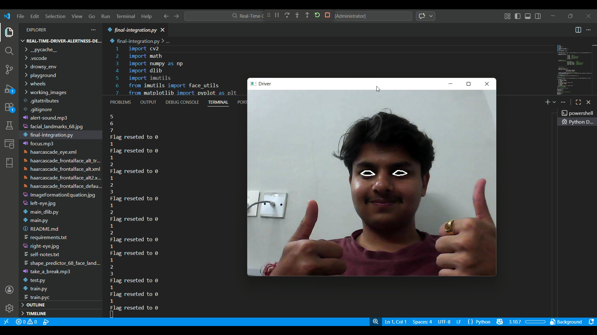
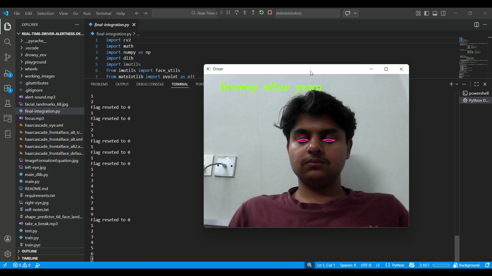

# 📘 Real-Time Driver Drowsiness Detection System

---

## 📌 Project Overview

The **Real-Time Driver Drowsiness Detection System** is a computer vision–based safety application designed to monitor a driver’s eye activity using a webcam and detect signs of fatigue in real time.

### 🔍 Key Concept

- Uses facial landmark detection to track eye regions.
- Computes **Eye Aspect Ratio (EAR)** to measure eye openness.
- Detects prolonged eye closure indicating possible drowsiness.
- Triggers an **audio alert** when fatigue is detected.
- Helps reduce accident risk through early warning.

---

## 🧠 How It Works

- Captures live webcam video stream.
- Detects face using Dlib’s 68-point facial landmark model.
- Extracts eye landmarks from detected face.
- Calculates EAR for both eyes.
- Applies temporal thresholding (closed for X frames).
- Triggers alert sound if drowsiness persists.

---

## 🛠 Technologies Used

- **Python** – Core programming language  
- **OpenCV** – Video capture and real-time image processing  
- **Dlib** – 68-point facial landmark detection  
- **Haar Cascades** – Backup face detection mechanism  
- **NumPy** – Mathematical computations and EAR calculations  
- **VLC / Audio Module** – Alert sound playback system  

---

## 📸 Project Snapshots

### 👀 Eye Tracking Detection


---

### 😮 Yawn Detection


---

### 🚨 Drowsiness Alert


---

## 📂 Project Structure

Real-Time-Driver-Alertness-Detection-System/
│
├── final-integration.py # Main detection pipeline
├── main_dlib.py # Dlib-based implementation
│
├── shape_predictor_68_face_landmarks.dat # Facial landmark model
├── alert-sound.mp3 # Drowsiness alert audio
│
├── assets/ # Project snapshots
├── wheels/ # Offline dlib wheels
│
├── requirements.txt
└── README.md

---

## 🧠 System Working Principle

The system operates through the following pipeline:

1. **Webcam Capture** – Live video frames are captured using OpenCV.  
2. **Face Detection** – Dlib’s frontal face detector identifies facial regions.  
3. **Landmark Extraction** – The 68-point facial landmark model extracts eye coordinates.  
4. **EAR Computation** – Eye Aspect Ratio (EAR) is calculated using eye landmark geometry.  
5. **Drowsiness Decision** – If EAR remains below a threshold for consecutive frames, an alert is triggered.

---

## 📐 Eye Aspect Ratio (EAR)

The Eye Aspect Ratio is defined as:

EAR = (||p2 − p6|| + ||p3 − p5||) / (2 ||p1 − p4||)

Where:

- `p1, p4` → Horizontal eye landmark points  
- `p2, p3, p5, p6` → Vertical eye landmark points  
- `||x − y||` → Euclidean distance  

### Interpretation

- Eye open → EAR ≈ 0.25 – 0.35  
- Eye closed → EAR decreases significantly  
- EAR < threshold (e.g., 0.20) for sustained frames → Drowsiness detected  

---

## 🔁 System Flow Diagram

Start
↓
Initialize Camera
↓
Capture Frame
↓
Detect Face (Dlib)
↓
Extract 68 Landmarks
↓
Compute EAR
↓
Is EAR < Threshold?
├── Yes → Increment Counter → If Counter > Limit → Trigger Alert
└── No → Reset Counter
↓
Display Frame
↓
Repeat

---

## ⚙️ Installation Guide (Cross-Platform)

### 1️⃣ Clone Repository

```bash
git clone <https://github.com/sainiswayam-9/Driver-Alertness-System>
cd Real-Time-Driver-Alertness-Detection-System

2️⃣ Create Virtual Environment (Recommended)

Windows
    python -m venv venv
    venv\Scripts\activate

macOS / Linux
    python3 -m venv venv
    source venv/bin/activate

3️⃣ Install Dependencies

pip install -r requirements.txt

4️⃣ Install dlib (If Automatic Install Fails)

🔹 Option A – Install via CMake
    pip install cmake
    pip install dlib

🔹 Option B – Install Precompiled Wheel (Windows)
    Wheel files are available inside the wheels/ directory.

    Check your Python version:
        python --version

    Install matching wheel (example for Python 3.10):
        pip install wheels/dlib-19.xx.xx-cp310-cp310-win_amd64.whl

    ⚠ Ensure:
        Python version matches wheel version
        64-bit Python is installed

5️⃣ Download Landmark Model

Download: shape_predictor_68_face_landmarks.dat

From: http://dlib.net/files/shape_predictor_68_face_landmarks.dat.bz2

Extract and place the .dat file in the project root directory.

6️⃣ Run the Application

python final-integration.py

---

## 🚨 Limitations of Current Experimental Version

- Dlib is computationally intensive  
- Installation complexity due to CMake/compiler requirements  
- Not optimized for low-end systems  
- No deep learning–based robustness  
- Performance affected by poor lighting conditions  
- Webcam driver compatibility issues on Windows (MSMF backend errors)  

---

## 🚀 Future Improvements (Planned)

- Replace Dlib with **MediaPipe Face Mesh** for improved performance  
- Enhance EAR robustness under low-light conditions  
- Add multi-threaded audio and visual alert system  
- Build a **Streamlit-based Web Dashboard**  
- Implement driver session logging and analytics  
- Integrate CNN-based eye-state classifier (MobileNetV2)  
- Deploy as a **Progressive Web App (PWA)**  
- Optimize inference performance using GPU acceleration  

---

## 📄 License

This project is developed for **academic and experimental purposes**.

---

## 🤝 Contributing

Contributions are welcome!

- Fork the repository  
- Create a new branch  
- Commit your changes  
- Push to your branch  
- Submit a Pull Request  

---

## 📊 Experimental Status

This version is an **experimental prototype** and serves as a baseline implementation.

The next planned version will migrate to:

- **MediaPipe Face Mesh** for improved stability  
- Easier installation and cross-platform support  
- Better real-time performance and robustness  

---

## 📚 Conclusion

The **Real-Time Driver Drowsiness Detection System** demonstrates how classical computer vision techniques can enhance driver safety through real-time monitoring.

While the Dlib-based implementation validates feasibility, future iterations will focus on improved robustness, simplified deployment, and real-world reliability using modern landmark and deep learning approaches.

---

## 📬 Contact

For questions or collaboration inquiries:

📧 **Email:** sainiswayam7@gmail.com  
📱 **Phone:** +91-7009570187  
🔗 **LinkedIn:** https://www.linkedin.com/in/swayam-saini-46008626a  

---
